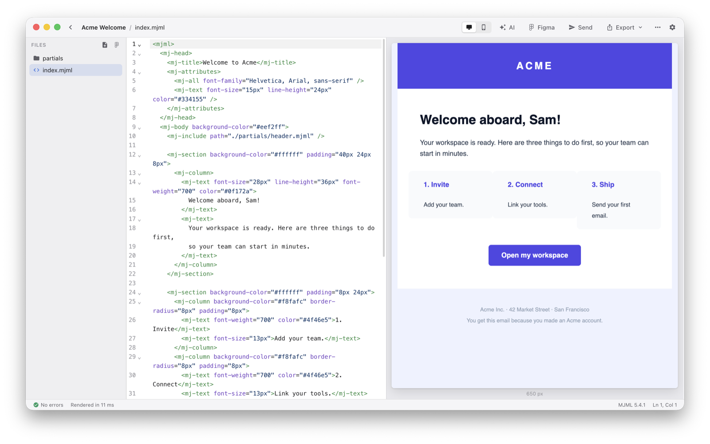
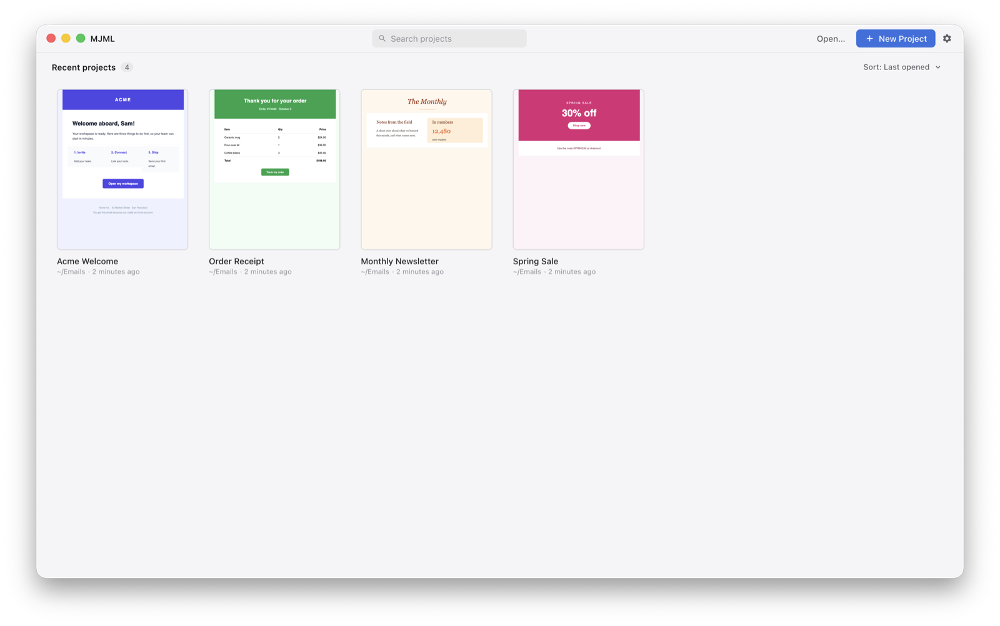

<p align="center">
  
</p>

<h1 align="center">MJML App</h1>

<p align="center">
  The desktop editor for <a href="https://mjml.io">MJML</a> emails, with a live preview.<br />
  For macOS, Windows and Linux.
</p>

<p align="center">
  <a href="https://ahmetkorkmaz3.github.io/mjml-app/"><strong>Website</strong></a> ·
  <a href="https://github.com/ahmetkorkmaz3/mjml-app/releases/latest"><strong>Download</strong></a> ·
  <a href="CHANGELOG.md">Changelog</a> ·
  <a href="CONTRIBUTING.md">Contributing</a>
</p>

<p align="center">
  <a href="https://github.com/ahmetkorkmaz3/mjml-app/releases/latest"></a>
  <a href="https://github.com/ahmetkorkmaz3/mjml-app/actions/workflows/ci.yml"></a>
  <a href="LICENSE"></a>
</p>

<picture>
  <source media="(prefers-color-scheme: dark)" srcset="assets/screenshot-dark.png" />
  
</picture>

## Features

- **Live preview**: the email renders as you type, at the desktop or the mobile width.
- **Code editor**: CodeMirror 6 with MJML autocompletion. MJML errors show next to the line.
- **Figma import with AI**: select a frame in Figma and get MJML. Then refine it with AI. Use Claude, OpenAI, Gemini or a local model (Ollama, LM Studio).
- **Test emails**: send the email to your inbox with your Mailjet account.
- **Templating**: preview Handlebars or ERB templates with variables in YAML or JSON.
- **HTML export**: minified or readable HTML. The app copies the local images that the email uses.
- **Partials**: split an email into files with `mj-include`. Each partial shows its own preview.
- **MJML 5 included**: or use your own `mjml` binary and `.mjmlconfig` file.
- **Light and dark themes** that follow your system.

<picture>
  <source media="(prefers-color-scheme: dark)" srcset="assets/projects-dark.png" />
  
</picture>

## Installation

Download the file for your platform from the [latest release](https://github.com/ahmetkorkmaz3/mjml-app/releases/latest):

| Platform | File                                                    |
| -------- | ------------------------------------------------------- |
| macOS    | `.dmg`: `arm64` for Apple silicon, `x64` for Intel Macs |
| Windows  | `.exe` installer, or `.zip` for a portable app          |
| Linux    | `.AppImage` or `.tar.gz` (x64)                          |

### The first launch

The installers are not signed, so macOS and Windows show a warning the first time you open the app.

- **macOS**: open the `.dmg` and move MJML to Applications. Then run this command in Terminal:

  ```bash
  xattr -dr com.apple.quarantine /Applications/MJML.app
  ```

  Or open the app, then go to System Settings > Privacy & Security and click "Open Anyway".

- **Windows**: when SmartScreen shows "Windows protected your PC", click "More info", then "Run anyway".

### Updates

On Windows and Linux (`.AppImage`), the app updates itself from the GitHub releases. On macOS, download the new `.dmg` from the [releases page](https://github.com/ahmetkorkmaz3/mjml-app/releases).

## Build from source

You need Node.js 24 (see `.nvmrc`) and Yarn 1.

```bash
git clone https://github.com/ahmetkorkmaz3/mjml-app.git
cd mjml-app
yarn        # install the dependencies
yarn dev    # start the app with hot reload
```

See [CONTRIBUTING.md](CONTRIBUTING.md) for the other commands, the project structure and the release steps.

## Contributing

Bug reports, ideas and pull requests are welcome. Read [CONTRIBUTING.md](CONTRIBUTING.md) before you open a pull request.

A bug in the rendered HTML is usually an MJML bug. Report it in [mjmlio/mjml](https://github.com/mjmlio/mjml/issues).

## Credits

MJML App is a fork of [mjmlio/mjml-app](https://github.com/mjmlio/mjml-app), by the MJML team and its contributors.

## License

[MIT](LICENSE)
